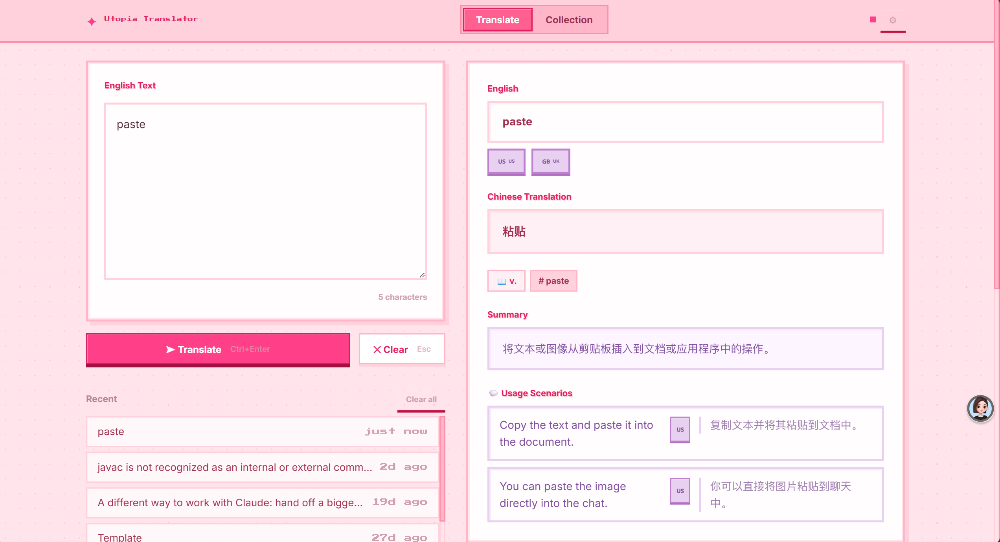
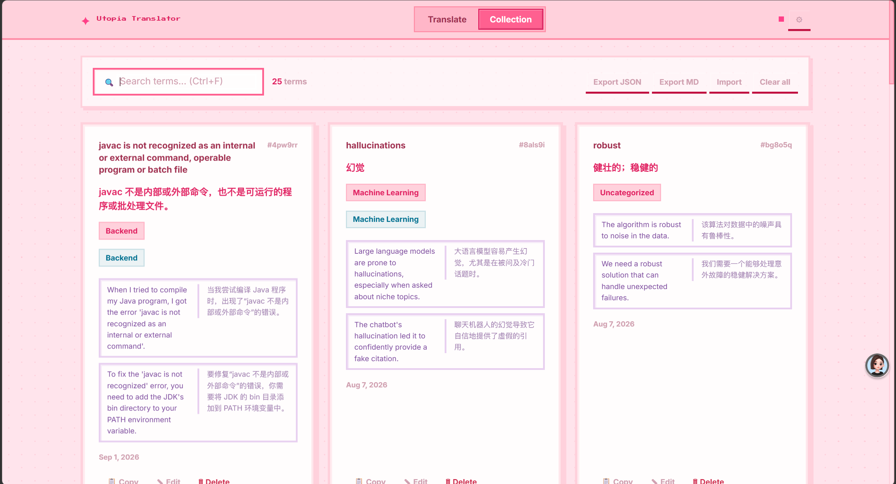

# Utopia Translator

一个轻量的浏览器端英文学习与技术术语翻译工具。输入英文单词、短语或段落后，应用可调用 DeepSeek 生成中文翻译，并补充专业领域、词性、关键词、摘要和使用场景，帮助用户建立可检索的个人术语库。

项目采用单 HTML 文件实现，无需安装依赖或构建项目；打开 `英语翻译.html` 即可使用。

## ✨ 项目亮点

- 面向学术与技术文本设计，翻译结果可附带领域、词性和关键词分析。
- 支持段落摘要与中英使用场景，适合阅读论文、技术文档和代码报错信息。
- 支持浏览器内置语音合成，可播放英文的 US / UK 发音及示例句。
- 翻译历史和个人术语库保存在浏览器本地，支持搜索、编辑、复制和删除。
- 支持 JSON 备份恢复，以及 Markdown 格式导出。
- 内置像素风粉色界面，并可在设置中自定义主题色。

## 📱 项目预览

翻译页面：输入英文并查看翻译、标签、摘要和使用场景。

<p align="center">
  
</p>

Collection 页面：搜索和管理已保存的个人术语。

<p align="center">
  
</p>

## 🚀 核心功能

### 英文翻译与技术分析

在 Translate 页面粘贴英文内容，应用会请求配置的 DeepSeek 兼容 Chat Completions 接口，并尝试返回：

- 中文翻译
- 专业领域，例如 Machine Learning、NLP、Database、Frontend 等
- 单词或短语的词性
- 关键技术词汇
- 段落摘要或术语解释
- 1～3 条中英使用场景

未配置 API key 时，页面仍可打开和使用本地历史、术语库及导入导出功能；实际中文翻译需要先配置 API。

### 历史记录与术语收藏

每次翻译会自动加入 Recent 列表，最多保留 100 条历史记录，界面显示最近 10 条。翻译结果可以添加标签并保存为术语，之后在 Collection 页面中：

- 按英文、中文或标签搜索
- 复制中英释义
- 编辑英文、中文和标签
- 删除单条或清空全部术语

### 数据导入导出

Collection 页面支持：

- 导出包含术语和历史记录的 JSON
- 导出适合阅读和分享的 Markdown 术语表
- 导入 JSON 数据并合并已有内容

### 发音、快捷键与主题

- 使用浏览器 Web Speech API 播放 US / UK 英文发音。
- `Ctrl + Enter`：翻译
- `Esc`：清空输入并重置结果
- `Ctrl + S`：保存当前结果
- `Ctrl + F`：打开 Collection 并聚焦搜索框
- 在 API Settings 中修改主题强调色，配色会保存到当前浏览器。

## 🛠 技术栈

| 类型 | 技术 |
| --- | --- |
| 页面 | HTML5 单文件 |
| 样式 | CSS3，内嵌响应式布局与像素风主题 |
| 逻辑 | 原生 JavaScript（无前端框架） |
| 数据存储 | 浏览器 `localStorage` |
| 翻译接口 | DeepSeek Chat Completions API，支持自定义 Endpoint 与 Model |
| 浏览器能力 | Fetch API、Web Speech API、Clipboard API、File API |
| 字体 | Google Fonts：Press Start 2P、DotGothic16、Inter |

## 🏗 项目结构

```text
Translater/
├── 英语翻译.html                         # 页面、样式与 JavaScript 逻辑
├── screenshots/
│   ├── 6a181af68e0cf3e25755b3bfb721e53e.png
│   └── 77f584015ed066f0f413735712e36729.png
└── README.md
```

单文件中的主要逻辑模块包括：

- `Theme`：主题色计算、应用与持久化
- `Storage`：翻译历史、术语、设置及导入导出
- `Translator`：API 请求、响应解析与本地元数据分析
- `UI`：翻译结果、历史列表、术语卡片和弹窗渲染
- `App`：事件绑定、快捷键和页面流程控制

## ⚙️ 快速开始

### 1. 打开应用

无需安装依赖，直接用现代浏览器打开：

```text
英语翻译.html
```

应用也可以作为普通静态文件部署到静态文件服务器上。

### 2. 配置翻译 API

1. 点击右上角齿轮进入 `API Settings`。
2. 填入自己的 API Key。
3. 默认 Endpoint 为 `https://api.deepseek.com/v1/chat/completions`。
4. 默认模型为 `deepseek-chat`；如使用兼容接口，可同时修改 Endpoint 和 Model。
5. 点击 `Test` 验证连接，再点击 `Save` 保存设置。

API key 只写入当前浏览器的 `localStorage`，不会写入 HTML 文件或项目源码。由于请求在浏览器端直接发出，不建议把包含个人 API key 的浏览器环境用于公开演示或共享。

## 📖 基本使用流程

```text
输入英文
   ↓
点击 Translate 或按 Ctrl + Enter
   ↓
查看翻译、领域、词性、关键词和使用场景
   ↓
添加标签并点击 Save Term
   ↓
在 Collection 中搜索、编辑、复制或导出
```

## 注意事项

- 翻译能力依赖用户配置的 DeepSeek 或兼容接口，项目本身不内置 API key。
- API key 保存在浏览器本地，但仍会被前端代码用于发起网络请求；请使用适合客户端环境的密钥管理策略。
- Google Fonts 为外部资源；无法访问时页面仍可使用系统字体回退。
- 语音播放依赖浏览器对 Web Speech API 的支持，具体可用音色由操作系统和浏览器决定。
